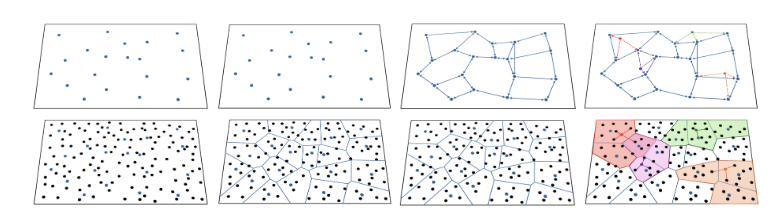

# Submission to the SISAP 2024 Indexing Challenge
This repository is a submission to the [SISAP 2024 Indexing Challenge](https://sisap-challenges.github.io/)[1]. This implementation is submitted under the team name `HSP`, and accompanied by a short paper to appear in the SISAP Conference Proceedings:

> Cole Foster, Edgar Chavez and Benjamin Kimia. "Top-Down Construction of Locally Monotonic Graphs for Similarity Search." In International Conference on Similarity Search and Applications, 2024.

#### Overview
This approach tests the performance of the HSP Graph, a monotonic graph, for graph-based similarity search. Since the exact HSP Graph has a quadratic construction complexity, we instead focus on preserving monotonicity locally, i.e., with a *locally monotonic graph*. This submission defines a top-down graph construction approach to build a high-quality approximation of the HSP Graph, where a graph on each layer in the hierarchy facilitates the construction of the graph on the layer below. The approach leverages a hierarchical partitioning for the dataset, where each layer contains a set of pivots sampled from the dataset according to some scaling factor `s`, and each layer is partitioned into the domains of the pivots on the layer above. The graph on each layer undergoes a distributed construction, where each node performs graph-search over the coarser-layer graph to identify `p` nearby domains and then selects their neighbors from that region. The hyperparameters `s` and `p` play a major role in the overall index construction time and graph quality. 

#### The LAION Dataset
The LAION dataset[2] is large-scale open source collection of text-image pairs. The challenge uses a subset of 100M text-image pairs from the English subset of the LAION dataset. It extracts 768D floating-point vectors to serve as the dataset, where the similarity is measured by the inner product. 

The dataset can be obtained from the [Indexing Challenge Website](https://sisap-challenges.github.io/2024/datasets/#public_queries__2). 
The example script `search.py` data automatically downloads the dataset and queries to the `data/` folder. This implementation uses the negative inner product as a distance measure, $d(x,y) = 1 - <x,y>$.

#### Running
The source code is written in C++, and leverages the skeleton of [hnswlib](https://github.com/nmslib/hnswlib.git) to maximize efficiency. The implementation also has Python bindings. Please see the example in `search/search.py` to see how to build the index and search over it. 

#### Evaluation
The `search.py` script automatically saves the results of the search to the directory `result/`. The performance may be evaluated using the scripts in `eval/` directory. The scripts are copied from [here](https://github.com/sisap-challenges/sisap23-laion-challenge-evaluation/tree/master).

The recall for all results can be measured using the `eval/eval.py` script. This script prepares all results in a nice CSV file `res.csv`.  
~~~bash
python3 eval/eval.py
~~~

The script `eval/plot.py` will plot the recall-throughput performance for a single dataset size. It takes the result csv and the dataset size as an input and saves the plot as a png, e.g., `result_300K.png`. 
~~~bash
python3 eval/plot.py res.csv --size 300K
~~~

#### References
> [1] Tellez, Eric S., Martin Aumüller, and Vladimir Mic. "Overview of the SISAP 2024 Indexing Challenge." In International Conference on Similarity Search and Applications. Cham: Springer Nature Switzerland, 2024.
>
> [2] Schuhmann, C., Beaumont, R., Vencu, R., Gordon, C., Wightman, R., Cherti, M., ... & Jitsev, J. (2022). Laion-5b: An open large-scale dataset for training next generation image-text models. arXiv preprint arXiv:2210.08402.